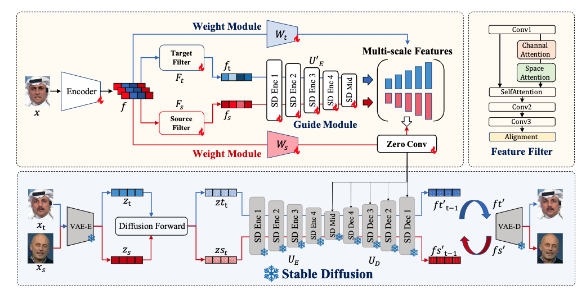

# DiffusionFake: Enhancing Generalization in Deepfake Detection via Guided Stable Diffusion
This repository is the official implementation of ["DiffusionFake: Enhancing Generalization in Deepfake Detection via Guided Stable Diffusion"](https://arxiv.org/pdf/2410.04372)
## Overview

DiffusionFake is a novel plug-and-play framework designed to enhance the generalization of DeepFake detection models. It achieves this by leveraging a pre-trained Stable Diffusion model to guide the detection model to learn more discriminative features from both source and target identities. This approach allows the detection model to become more resilient against unseen forgeries without introducing additional parameters during inference.


## Model and Data Preparation


### Environment

- Python 3 (Recommend to use Anaconda)
- PyTorch >= 1.0
- NVIDIA GPU + CUDA (Need at least 40G GPU memory)

Before run the code, you should run

```shell
$ pip install -r requirements.txt
```

### Pre-trained Model Download

1. Download the original Stable Diffusion model from Hugging Face.
2. Convert the model using ControlNet's transformation script with the following command:
   ```bash
   python tool_add_control.py ./models/v1-5-pruned.ckpt ./models/control_sd15_ini.ckpt
   ```
   This will generate `control_sd15_ini.ckpt`. Place this file under the `model` directory.

### Training Data Preparation

Organize the FaceForensics++ (FFPP) dataset in the following structure:

```
faceforensics++
├── manipulated_sequences
│   ├── Deepfakes
│   │   └── c23
│   │       ├── 000_003
│   │       │   ├── 000_003_0000.png
│   │       │   ├── 000_003_0001.png
│   │       │   └── ...
│   │       ├── 001_870
│   │       └── ...
│   ├── Face2Face
│   ├── FaceSwap
│   └── NeuralTextures
└── original_sequences
    └── youtube
        └── c23
            ├── 000
            │   ├── 000_0000.png
            │   ├── 000_0001.png
            │   └── ...
            ├── 001
            └── ...
```


### Generate Training Weights

Run the following command to generate a similarity JSON file for training:

```bash
python generate_weight.py
```

## Configuration

Edit the configuration files in the `configs` directory to match your file paths and desired settings. Each YAML file should be configured accordingly.

## Training

To start training, use the following command:

```bash
CUDA_VISIBLE_DEVICES=X python train.py -c configs/train.yaml
```

Replace `X` with the appropriate GPU ID. The log information and checkpoint will be saved in the `wandb` directory.

## Testing

To test the model, run the following command:

```bash
CUDA_VISIBLE_DEVICES=X python test.py
```

You can use different downstream datasets to evaluate the generalization performance of the model. And remember to change the correct `data_root` in the `configs/test.yaml` file. For test data, you can parpre your own data and dataloader in the `datasets` folder. Here we provide an example for the Celeb-DF dataset.


## Acknowledgment

This project is based on the [ControlNet](https://github.com/lllyasviel/ControlNet?tab=readme-ov-file) project.